# PRD: Mermaid Toolkit for Google Docs™

## Overview

Mermaid Toolkit is a Google Docs™ add-on that lets users write Mermaid diagram syntax directly in their documents and render it as high-quality PNG images. Everything runs client-side in the browser — no servers, no data collection, no cookies.

---

## Architecture & Diagrams

### System Architecture

The add-on runs entirely within Google Docs™. The GAS server handles document manipulation (finding code blocks, inserting/replacing images), while each dialog runs in a sandboxed iframe that loads mermaid.js from jsDelivr to render diagrams client-side. Communication between dialogs and server happens via `google.script.run`.

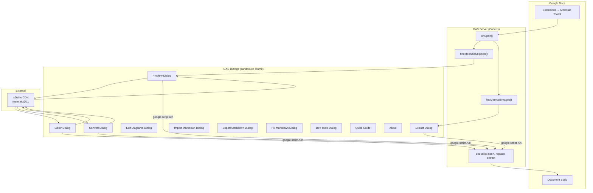

### Rendering Pipeline

Every diagram goes through a multi-pass pipeline from text to image. The pipeline handles two key challenges entirely client-side: (1) Mermaid v11's `<foreignObject>` elements taint the HTML canvas, and (2) CSS-driven layouts (C4 diagrams) use `width: 100%` with negative `viewBox` offsets that break static image rendering.

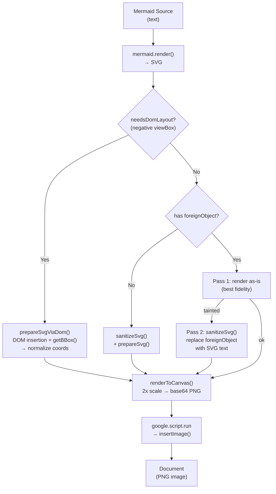

**Key techniques:**
- **Pass 1 (preserve fidelity):** Render SVG with `<foreignObject>` intact for maximum visual quality
- **Pass 2 (sanitize):** If canvas is tainted, replace `<foreignObject>` with pure SVG `<text>` equivalents preserving bold, color, and font-size
- **Pass 3 (DOM measurement):** For CSS-driven layouts, insert SVG into a hidden DOM element with `position:fixed;width:100vw`, use `getBBox()` to measure actual content bounds, then translate content to `(0,0)` and normalize the `viewBox`

---

## Content Safety Tests

The sections below test that the add-on correctly ignores non-mermaid content and doesn't corrupt existing document elements. When you run "Convert All Code to Diagrams", only the actual mermaid blocks above should be detected — nothing below should be touched.

### Regular text that mentions mermaid keywords

This paragraph contains words like flowchart, sequenceDiagram, and graph TD but they're just plain text in a paragraph, not inside a code block. The add-on must ignore these completely.

Here's another paragraph that says ```mermaid but it's inline code, not a fenced block. And graph LR is just text. The scanner should not pick any of this up.

### Non-mermaid code blocks

```javascript
function renderDiagram() {
  const graph = buildFlowchart();
  return graph.render();
}
```

```python
# This is a Python script, not mermaid
flowchart = {
    "nodes": ["A", "B", "C"],
    "edges": [("A", "B"), ("B", "C")]
}
print(flowchart)
```

```sql
SELECT * FROM diagrams
WHERE type = 'flowchart'
AND status = 'active'
ORDER BY created_at DESC;
```

```
This is an unfenced code block with no language tag.
graph TD
    A --> B
It looks like mermaid but has no ```mermaid fence.
```

### Tricky almost-mermaid blocks


```MERMAID
graph TD
    A --> B
```

```text
flowchart TD
    A --> B
    B --> C
```

### Tables that should be ignored

| Feature | Status | Notes |
|---------|--------|-------|
| flowchart | Done | graph TD works |
| sequenceDiagram | Done | All arrow types |
| classDiagram | Done | Inheritance ok |

### Images that should be ignored

If you paste a regular (non-mermaid) image here, the add-on's "Convert All Diagrams to Code" should skip it since it won't have the mermaid-diagram alt title.

### Mixed content around a real diagram

This paragraph comes right before a real mermaid diagram. The add-on should detect the diagram below but leave this text untouched.

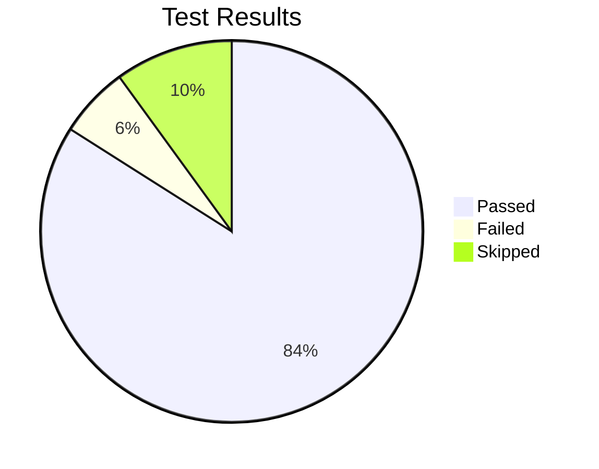

And this paragraph comes right after. It should remain exactly where it is after the diagram is converted. No text should be deleted, moved, or duplicated.

### Nested formatting edge cases

**Bold text** with a `code span` that says graph TD and *italic text* mentioning ```mermaid should all be left alone.

> This is a blockquote that mentions mermaid diagrams.
> flowchart LR
>     A --> B
> Blockquotes are not code blocks.

1. Numbered list item mentioning flowchart
2. Another item with sequenceDiagram
3. A third item — none of these are code blocks

- Bullet with graph TD
- Bullet with classDiagram
- These are just list items

### Empty and malformed mermaid blocks

```mermaid
```

```mermaid

```

```mermaid
this is not a valid diagram keyword
just random text inside a mermaid fence
```

```mermaid
%% Only a comment, no diagram type keyword
%% The scanner requires line 1 to be a keyword
```

### Real diagram after all the noise

If the add-on survived all the above without false positives, this final diagram should render correctly:

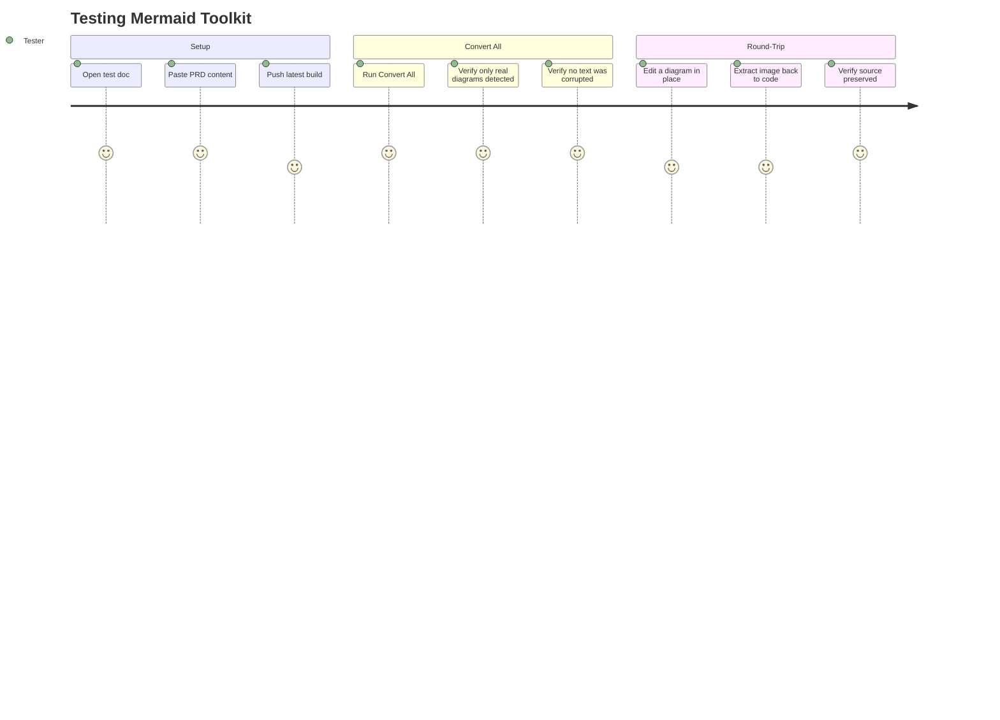

---

### Build Pipeline

The GAS build compiles TypeScript and SCSS from modular source files into self-contained HTML files with all CSS and JS inlined. The server-side Code.ts gets special treatment — esbuild bundles it as an IIFE, then post-processing strips the wrapper and converts arrow functions to GAS-compatible function declarations.

```mermaid
flowchart TD
    subgraph "Source (src/gas/)"
        ServerTS["server/Code.ts\n+ modules"]
        DialogTS["dialogs/*/dialog.ts"]
        DialogSCSS["dialogs/*/dialog.scss"]
        DialogHTML["dialogs/*/dialog.html"]
        SharedTS["shared/scripts/*.ts"]
        SharedSCSS["shared/styles/**/*.scss"]
        Templates["shared/templates/footer.html"]
    end

    subgraph "Build (scripts/build-gas.ts)"
        ESBuild1["esbuild\nIIFE → strip → fn decl"]
        ESBuild2["esbuild\nbundle + minify IIFE"]
        Sass["sass\ncompressed"]
        Assemble["HTML Assembly\nCSS + JS inlined"]
        Stamp["Version Stamp\nmenu title"]
    end

    subgraph "Output (dist/gas/)"
        CodeGS["Code.gs"]
        AboutHTML["About.html"]
        EditorHTML["Editor.html"]
        PreviewHTML["Preview.html"]
        ExtractHTML["Extract.html"]
        ConvertHTML["Convert.html"]
        FixMDHTML["FixMarkdown.html"]
        ImportHTML["ImportMarkdown.html"]
        ExportHTML["ExportMarkdown.html"]
        EditDiagHTML["EditDiagrams.html"]
        DevToolsHTML["DevTools.html"]
        QGHTML["QuickGuide.html"]
        Manifest["appsscript.json"]
    end

    ServerTS --> ESBuild1 --> CodeGS
    DialogTS --> ESBuild2
    SharedTS --> ESBuild2
    DialogSCSS --> Sass
    SharedSCSS --> Sass
    ESBuild2 --> Assemble
    Sass --> Assemble
    DialogHTML --> Assemble
    Templates --> Assemble
    Assemble --> AboutHTML
    Assemble --> EditorHTML
    Assemble --> PreviewHTML
    Assemble --> ExtractHTML
    Assemble --> ConvertHTML
    Assemble --> FixMDHTML
    Assemble --> ImportHTML
    Assemble --> ExportHTML
    Assemble --> EditDiagHTML
    Assemble --> DevToolsHTML
    Assemble --> QGHTML
    CodeGS --> Stamp
```

### User Flow: Convert All Code to Diagrams

The primary workflow. The server scans the document for all mermaid code blocks, serializes their positions and content as JSON, and passes them to the Preview dialog. The dialog loads mermaid.js, renders each snippet, and presents cards with insert/replace options. Replacements happen in reverse document order to preserve element indices.

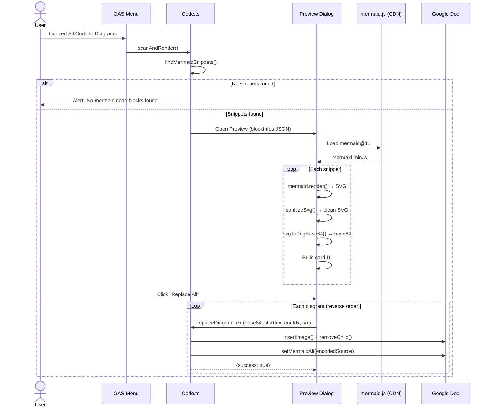

### User Flow: Round-Trip Editing

The full lifecycle of a diagram: write code, convert to image, edit in place, and extract back to code. The key enabler is source preservation — every image stores its mermaid source in the alt description with encoded newlines, so the original code can always be recovered.

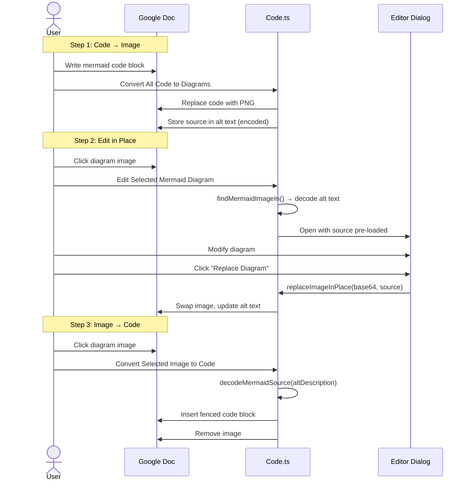

### Source Preservation (Alt Text Encoding)

Google Docs™ strips newline characters from image alt descriptions. To preserve multi-line mermaid source code, we encode `\n` as the literal two-character sequence `\n` (and escape existing backslashes as `\\`) before storing. On read, we decode back. This ensures the original source with proper line breaks survives the round-trip through Google Docs™' storage.

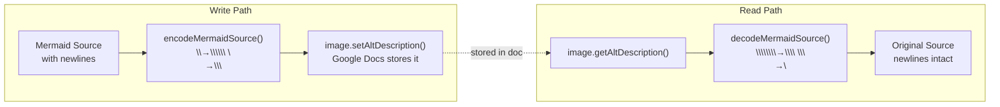

### Dialog Structure

All 10 dialogs share a common set of styles and scripts via the `shared/` directory. Each dialog has its own HTML template, TypeScript, and SCSS, but imports shared M3 components (buttons, cards, spinners, headers, footers) and utility scripts (mermaid initialization, SVG-to-PNG conversion, DOM helpers). The build inlines everything into self-contained HTML files.

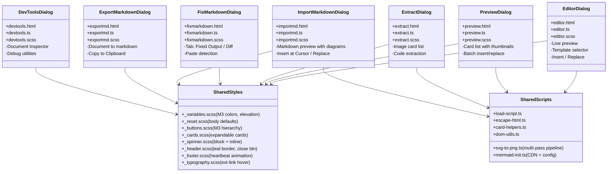

### Code Detection Logic

The scanner walks every child element of the document body. It recognizes mermaid code in three formats: native Google Docs™ code snippets (where the first line must be a diagram keyword), fenced blocks within a single paragraph or table cell, and multi-paragraph fences that span several elements. Non-mermaid code blocks, plain text, and other elements are skipped.

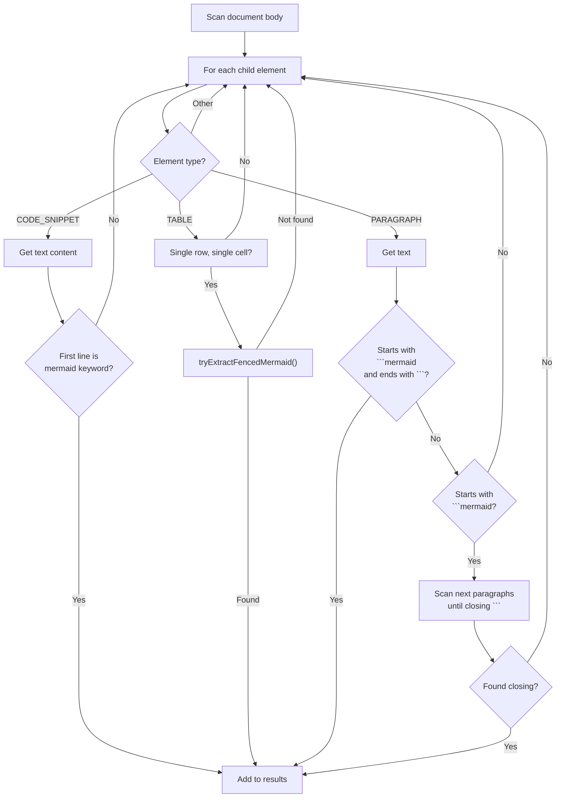

### Deployment Flow

`yarn gas:push` runs the full verify (ESLint + TypeScript) before building and pushing. It compiles the GAS source to `dist/gas/` and pushes via `clasp`.

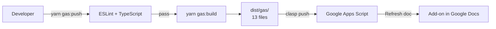

### Website Structure

The marketing site is built with Eleventy and Nunjucks. The homepage flows through five sections in order, with the Getting Started section using a tabbed showcase layout. Feature details, the live gallery, and legal pages are separate routes.

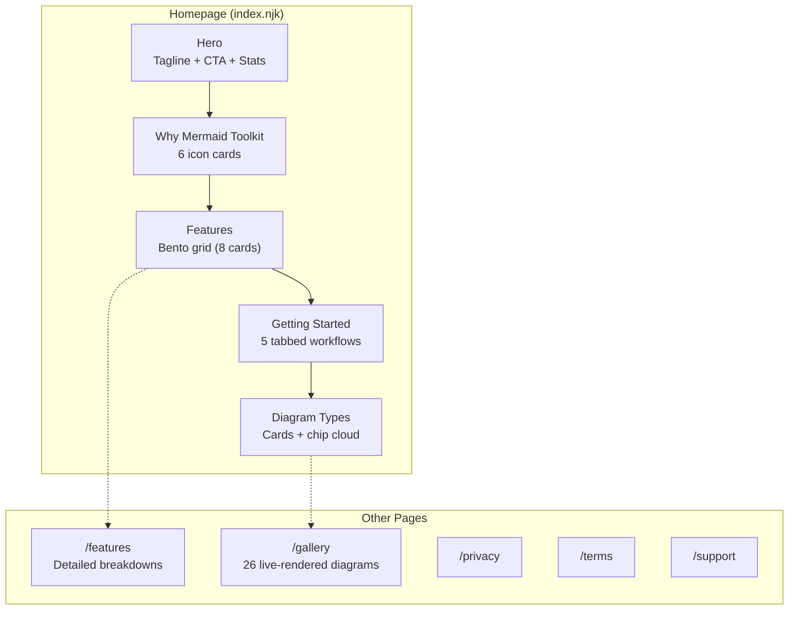

### State Diagram: Fix Markdown Dialog

The Fix Markdown dialog handles corrupted mermaid syntax caused by Google Docs™ mangling pasted markdown (vertical tabs replacing newlines, stray backticks, formatting artifacts). The user pastes broken content, the dialog detects and repairs mermaid blocks, and presents both a cleaned output and a diff view.

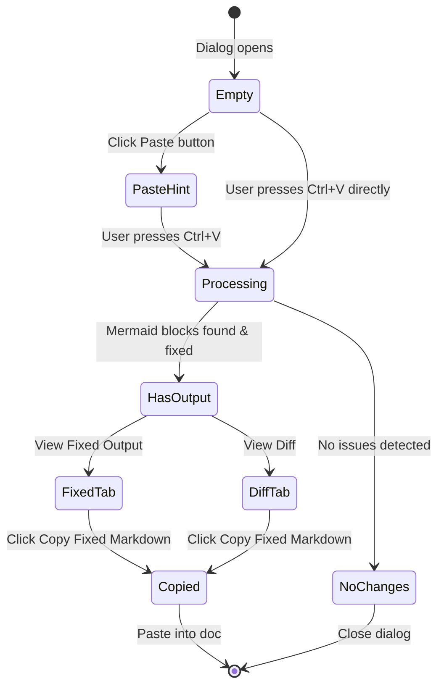

The project consists of two parts:

- **Add-on** (`src/gas/`) — Google Apps Script dialogs and server-side logic
- **Website** (`site/`) — Marketing/docs site built with Eleventy

---

## Add-on Features

### Menu Structure

All features are accessed via **Extensions → Mermaid Toolkit**:

| Menu Item | Dialog | Description |
|-----------|--------|-------------|
| Insert Mermaid Diagram | Editor | Side-by-side editor with live preview, syntax highlighting, and templates. Insert new diagrams or edit existing ones. |
| Edit Selected Mermaid Diagram | Editor | Click a diagram image, run this command — the editor opens with the source pre-loaded for in-place editing. |
| Convert All Code to Diagrams | Preview | Scans the entire document for Mermaid code blocks, renders all of them, and lets you insert or replace each one. |
| Convert Selected Code to Diagram | Convert | Select a single code block or fenced ```` ```mermaid ```` block and convert it to an image. |
| Edit All Mermaid Diagrams | EditDiagrams | Browse every diagram in the document, expand any card to edit its source inline with a live preview, and save changes in place. |
| Convert All Diagrams to Code | Extract | Finds all Mermaid diagram images in the document and lets you extract each one back to code. |
| Convert Selected Diagram to Code | — | Extracts the Mermaid source from a selected diagram image and inserts it as a fenced code block. |
| Import from Markdown | ImportMarkdown | Paste raw markdown with Mermaid code blocks, preview it, and insert formatted content with rendered diagrams. |
| Export as Markdown | ExportMarkdown | Convert document content back to markdown, extracting Mermaid source from diagram alt text. |
| Fix Native "Copy as Markdown" | FixMarkdown | Repairs corrupted Mermaid syntax caused by Google Docs™' native "Copy as Markdown" (vertical tabs, stray backticks, formatting artifacts). |
| Quick Guide | QuickGuide | Interactive walkthrough of the add-on's features. |
| Dev Tools | DevTools | Document inspector and debug utilities. |
| About | About | Version info, links, and credits. |

### Dialogs (11 total)

| Dialog | Size | Key Behavior |
|--------|------|-------------|
| **Editor** | 1000×700 | Two-panel: code editor (left) + live preview (right). Template selector with 26 diagram types. Buttons: Insert into Document, Replace Diagram. |
| **Preview** | 800×600 | Card list of all detected diagrams with thumbnails. Expandable cards show full preview + source. Buttons per card: Preview, Insert After, Replace. Batch: Insert All, Replace All, Expand All. |
| **Extract** | 800×600 | Card list of all Mermaid diagrams. Buttons per card: Insert Code After, Replace with Code, Open in Editor. |
| **EditDiagrams** | 800×600 | Card list of all Mermaid diagrams with inline editing. Expand a card to edit source with live preview. Save & Replace per card. |
| **Convert** | 360×180 | Auto-rendering dialog — renders selected code, replaces it with the image, and closes automatically. Shows spinner during render. |
| **ImportMarkdown** | 1000×700 | Paste markdown, preview rendered content with diagrams. Buttons: Insert at Cursor, Replace Document. |
| **ExportMarkdown** | 900×600 | Shows document content as markdown. Button: Copy to Clipboard. |
| **FixMarkdown** | 900×600 | Two tabs: Fixed Output and Diff. Left pane: paste area with line numbers. Right pane: cleaned output or side-by-side diff. |
| **DevTools** | 400×320 | Card-based action picker for Document Inspector and debug utilities. |
| **QuickGuide** | 440×600 | Feature grid with icons and descriptions. Links to website. |
| **About** | 320×280 | Brand card with icon (base64 inlined), version, privacy info, external links. |

### Supported Diagram Types (26)

flowchart, graph, sequenceDiagram, classDiagram, stateDiagram, erDiagram, gantt, pie, gitGraph, journey, mindmap, timeline, sankey, xychart, block-beta, packet-beta, quadrantChart, architecture-beta, kanban, requirementDiagram, c4context, c4container, c4component, c4dynamic, c4deployment, radar-beta

### Code Detection

The add-on detects Mermaid code in three formats:

1. **Google Docs™ Code Snippet** (Insert → Code block) — first line must be a diagram keyword
2. **Fenced code blocks** — ```` ```mermaid ... ``` ```` in a single paragraph or table cell
3. **Multi-paragraph fences** — ```` ```mermaid ```` on one paragraph, code on subsequent paragraphs, ```` ``` ```` on the closing paragraph

### Source Preservation

Every diagram image stores its Mermaid source in the image's alt description. Newlines are encoded as literal `\n` (and backslashes as `\\`) to survive Google Docs™' alt text processing. This enables round-trip editing: image → code → edit → image.

### Rendering Pipeline (Detail)

1. Mermaid.js loaded from jsDelivr CDN (`mermaid@11`)
2. `mermaid.render()` produces SVG
3. Multi-pass conversion via `svgToPngBase64()`:
   - **DOM layout path**: If SVG has negative `viewBox` offsets (C4 diagrams), insert into hidden DOM container, measure with `getBBox()`, normalize coordinates
   - **Direct path**: If no `<foreignObject>`, sanitize and render directly
   - **Two-pass path**: Try with `<foreignObject>` intact first (best fidelity), fall back to sanitized version if canvas is tainted
4. Rendered to canvas at 2x scale
5. `canvas.toDataURL()` produces base64 PNG
6. PNG inserted into document via `DocumentApp` API

### Mermaid Version

- **Add-on CDN**: `mermaid@11` (latest v11.x from jsDelivr)
- **Site npm**: `mermaid@^11.13.0`
- **Config**: `htmlLabels: false` globally + per diagram type to minimize `<foreignObject>` usage. Multi-pass pipeline handles remaining `<foreignObject>` and CSS-driven layouts without server involvement.

---

## UI/UX Design

### Design System: Material Design 3 (Option B2 — Teal Branding)

All dialogs follow a consistent M3-inspired design:

- **Colors**: M3 semantic roles (primary, secondary, tertiary, error, surface) with brand teal (`#00897b`) as identity color
- **Buttons**: M3 hierarchy — filled-primary, filled-secondary, tonal, outlined, text. Consistent 10px/24px padding, 12px border-radius, ripple effect.
- **Cards**: 16px border-radius, surface-tint background, elevation-1 shadow. Status badges (done/failed/pending with spinner).
- **Headers**: Teal top border, accent dot, styled close button.
- **Footer**: Heartbeat animation on teal heart icon.
- **Typography**: Roboto/Google Sans, 14px base.

### Key UX Decisions

- **No autofocus on close button**: Deferred blur script runs at 0ms, 100ms, 300ms to steal focus from GAS dialog chrome.
- **Template selector stays open**: Clicking a template highlights it but doesn't collapse the template section. Highlight clears on manual content edit.
- **External links**: Animated underline (left-to-right) + arrow nudge on hover, using brand teal.
- **UTM tracking**: All external links include `utm_source`, `utm_medium`, `utm_campaign=mermaid_toolkit`.
- **Brand icon**: Inlined as base64 data URI for reliability in GAS sandbox.

---

## Website

### Homepage Sections (in order)

1. **Hero** — Tagline, install CTA (pending verification), GitHub link, stats (0 data collected, 100% client-side, 26 diagram types), demo video
2. **Why Mermaid Toolkit** — 6 icon cards: AI-Friendly Workflows, Markdown Interop, Zero Data Collection, Round-Trip Editing, Bulk Operations, Fix Broken Markdown
3. **Features** — Bento grid of 8 feature cards from `features.json`
4. **Getting Started** — Tabbed showcase (Option A) with 5 workflows: Convert code to diagrams, Use the built-in editor, Edit diagrams in place, Convert images back to code, Fix pasted markdown. Each tab: screenshot (left 60%) + numbered steps (right 40%) with staggered slide-in animation.
5. **Diagrams** — Compatibility section with rendered diagram cards + keyword chip cloud

### Other Pages

- `/features` — Detailed feature page with screenshots (placeholders) and Fix Markdown deep-dive
- `/gallery` — All 26 diagram types rendered live with source code toggle
- `/privacy`, `/terms`, `/support` — Standard pages

---

## Build System

### GAS Build (`yarn gas:build`)

1. **Server**: esbuild compiles `Code.ts` → `Code.gs` (IIFE, post-processed to GAS-compatible function declarations)
2. **Styles**: Sass compiles each dialog's SCSS (with shared partials) → minified CSS
3. **Scripts**: esbuild bundles each dialog's TS (with shared modules) → minified IIFE JS
4. **Assembly**: HTML templates get CSS/JS inlined at `/* BUILD:INLINE_CSS */` / `/* BUILD:INLINE_JS */` markers, footer injected at `<!-- BUILD:FOOTER -->`
5. **Version stamp**: Build timestamp (`YYYYMMDD.HHmm`) injected into menu title for testing
6. **Manifest**: `appsscript.json` copied to `dist/gas/`

### Site Build (`yarn site:build`)

Eleventy + Sass + esbuild. Outputs to `_site/`.

### Scripts

| Command | Description |
|---------|-------------|
| `yarn site:dev` | Site dev server (localhost:8080) |
| `yarn site:build` | Production site build |
| `yarn site:lint` | ESLint site sources |
| `yarn site:lint:fix` | ESLint fix site sources |
| `yarn site:typecheck` | TypeScript check (site tsconfig) |
| `yarn gas:dev` | Watch GAS sources, rebuild on change |
| `yarn gas:build` | Build GAS add-on to `dist/gas/` |
| `yarn gas:push` | Smart verify → build → clasp push (skips if unchanged) |
| `yarn gas:login` | Authenticate with Google |
| `yarn gas:lint` | ESLint GAS sources |
| `yarn gas:lint:fix` | ESLint fix GAS sources |
| `yarn gas:typecheck` | TypeScript check (GAS tsconfigs) |
| `yarn verify` | Lint + typecheck everything |
| `yarn verify:fix` | Lint fix + typecheck everything |

---

## Project Structure

```
src/gas/
  server/
    Code.ts              # Server-side GAS entry points
    doc-utils.ts         # Document manipulation helpers
    snippets.ts          # Mermaid code block detection
    images.ts            # Mermaid image detection
    constants.ts         # Keywords, alt title
    types.ts             # TypeScript interfaces
    tsconfig.json        # GAS-specific TS config
  dialogs/
    about/               # about.html, about.scss
    convert/             # convert.html, convert.ts, convert.scss
    devtools/            # devtools.html, devtools.ts, devtools.scss
    editdiagrams/        # editdiagrams.html, editdiagrams.ts, editdiagrams.scss
    editor/              # editor.html, editor.ts, editor.scss
    exportmd/            # exportmd.html, exportmd.ts, exportmd.scss
    extract/             # extract.html, extract.ts, extract.scss
    fixmarkdown/         # fixmarkdown.html, fixmarkdown.ts, fixmarkdown.scss
    importmd/            # importmd.html, importmd.ts, importmd.scss
    preview/             # preview.html, preview.ts, preview.scss
    quickguide/          # quickguide.html, quickguide.scss
  shared/
    styles/
      base/              # _variables.scss, _reset.scss
      components/        # _buttons.scss, _cards.scss, _spinner.scss
      layout/            # _header.scss, _footer.scss, _typography.scss
    scripts/
      load-script.ts     # Dynamic script loader
      svg-to-png.ts      # SVG → PNG multi-pass rendering pipeline
      escape-html.ts     # HTML escaping
      mermaid-init.ts    # CDN URL + mermaid config
      card-helpers.ts    # Card/button state management
      dom-utils.ts       # DOM helpers
      fullscreen.ts      # Fullscreen/open-in-new-tab button
    templates/
      footer.html        # Shared footer markup
  appsscript.json
  tsconfig.dialogs.json  # Dialog-side TS config

site/                    # Eleventy website
scripts/                 # Build scripts (TypeScript)
dist/gas/                # Built GAS output (clasp pushes from here)
```

---

## Testing Checklist

### Add-on Core

- [ ] **Insert Mermaid Diagram**: Open editor, write flowchart, click Insert into Document. Verify image appears at cursor.
- [ ] **Templates**: Select a template, verify it loads in editor, verify active highlight, verify highlight clears on manual edit.
- [ ] **Edit Selected Mermaid Diagram**: Click an existing diagram image, run Edit. Verify editor opens with source pre-loaded. Edit and Replace.
- [ ] **Convert All Code to Diagrams**: Create multiple fenced mermaid blocks. Run Convert All. Verify all render in Preview dialog. Insert All / Replace All.
- [ ] **Convert Selected Code to Diagram**: Select a single code block. Run Convert Selected. Verify auto-render and replace.
- [ ] **Convert Selected Diagram to Code**: Click a diagram. Run Convert Selected Diagram to Code. Verify fenced code block appears.
- [ ] **Convert All Diagrams to Code**: Run with multiple diagrams. Verify Extract dialog lists all. Test Insert Code After, Replace with Code, Open in Editor.
- [ ] **Round-trip**: Code → Diagram → Edit → Diagram → Extract to Code. Verify source is preserved with correct newlines.
- [ ] **Fix Native "Copy as Markdown"**: Open dialog. Paste corrupted markdown (with vertical tabs). Verify Fixed Output and Diff tabs work. Copy Fixed Markdown button works.
- [ ] **Import from Markdown**: Open dialog. Paste markdown with Mermaid code blocks. Verify preview renders diagrams. Test Insert at Cursor and Replace Document.
- [ ] **Export as Markdown**: Open dialog. Verify document content is converted to markdown. Verify Mermaid source is extracted from diagram alt text. Test Copy to Clipboard.

### Diagram Types

- [ ] flowchart / graph
- [ ] sequenceDiagram
- [ ] classDiagram
- [ ] stateDiagram
- [ ] erDiagram
- [ ] gantt
- [ ] pie
- [ ] gitGraph
- [ ] journey
- [ ] mindmap
- [ ] timeline
- [ ] C4 variants (c4context, c4container, c4component, c4dynamic, c4deployment)

### UI/UX

- [ ] Buttons are consistent size/color across all dialogs
- [ ] No autofocus on close button when dialogs open
- [ ] External links have animated underline + arrow hover effect
- [ ] UTM parameters present on all external links
- [ ] Brand icon loads in About dialog
- [ ] Footer shows in dialogs that have it (not Quick Guide)
- [ ] Build version visible in menu title: "Mermaid Toolkit (vYYYYMMDD.HHmm)"

### Code Detection Formats

- [ ] Google Docs™ Code Snippet (Insert → Code block)
- [ ] Single-paragraph fenced block (```` ```mermaid ... ``` ````)
- [ ] Multi-paragraph fenced block (opening fence, code paragraphs, closing fence)
- [ ] Table cell with fenced block

### Edge Cases

- [ ] Empty document — "No mermaid code blocks found" alert
- [ ] No selection — appropriate alert messages
- [ ] Non-mermaid image selected — "Selected image is not a Mermaid diagram" alert
- [ ] Invalid mermaid syntax — error shown in Preview/Convert dialogs
- [ ] Very large diagrams — rendering completes, image quality acceptable
- [ ] Clipboard API blocked (Fix Markdown) — hint message appears, keyboard paste works

### Website

- [ ] Homepage sections render in correct order: Hero → Why → Features → Getting Started → Diagrams
- [ ] Getting Started tabs switch correctly, all 5 workflows show
- [ ] Gallery renders all diagram types (mermaid v11)
- [ ] Features page shows correct feature names (Edit Selected Mermaid Diagram, not Image)
- [ ] Nav links work (no broken links, Getting Started → #how)
- [ ] Mobile responsive layout

### Testing Nested Checklist, code and links and bold and italic etc.

- [ ] **Bold** and *italic* and ~~strikethrough~~ and `inline code`
  - [ ] Nested with **bold `code` combo** and [a link](https://example.com)
    - [ ] Deep nested with ***bold italic*** and `yarn gas:push`
    - [x] Deep nested checked with ~~done~~
  - [x] Nested checked with *italic* and `multiple` `code` `spans`
- [ ] Top level with [Mermaid docs](https://mermaid.js.org/) link
  - [ ] Nested **bold** and *italic* and `code` all together
  - [ ] Nested ~~strikethrough~~ with **bold [linked text](https://example.com)**
    - [ ] Deep with `const x = 42;` and **`highlighted code`**
    - [ ] Deep with *`italic code`* and ~~`struck code`~~
- [x] Checked top level with **all** *the* ~~styles~~ `combined`
  - [x] Checked nested with [link](https://example.com) and **bold**
    - [x] Checked deep with `yarn verify` and *italic*
