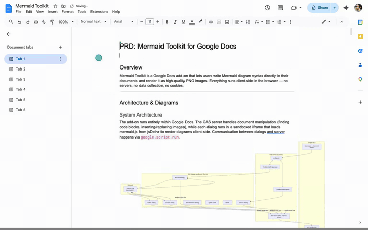
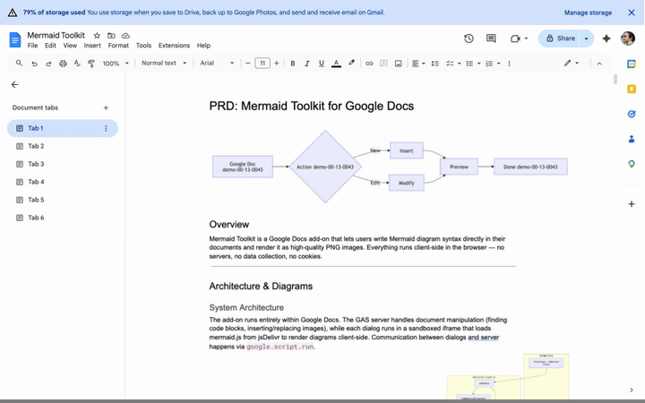
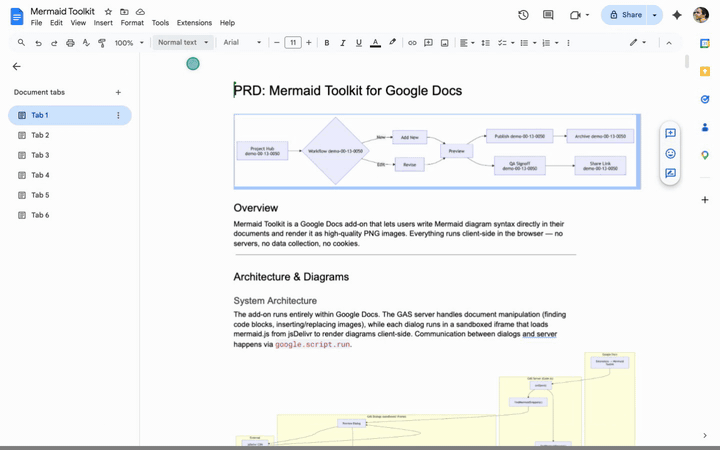
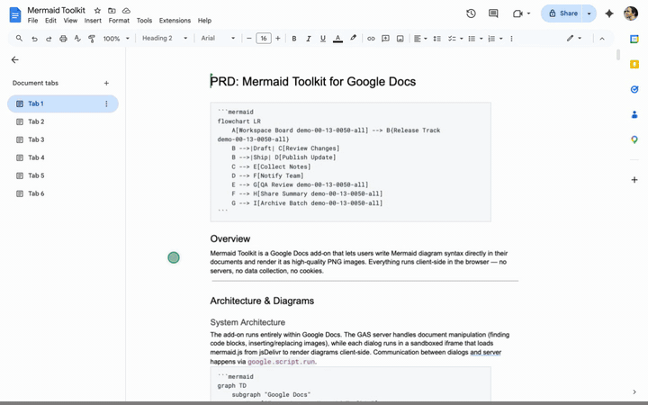
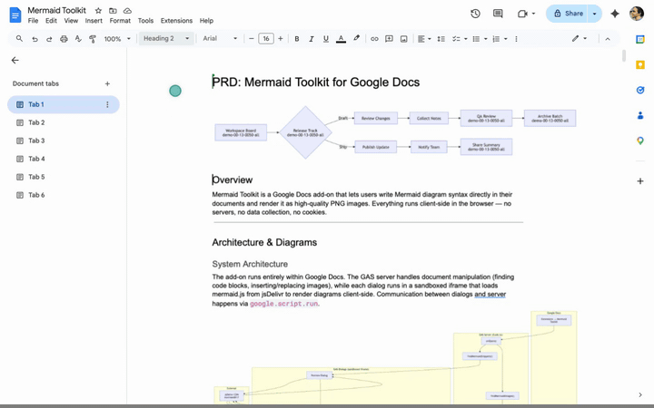
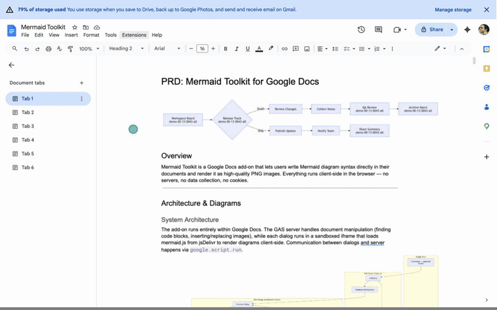

   
   
   

---

> **⏳ Awaiting Google Verification:** Currently undergoing branding verification by Google's Trust and Safety team. The Marketplace listing will be submitted for review once verification is complete. Install link coming soon!

---

   
   
   


# Mermaid Toolkit for Google Docs™

Render Mermaid diagrams as images directly in Google Docs™.  
Client-side rendering — no data leaves your browser.


---

## Why Mermaid Toolkit?

- **AI-friendly workflows** — Mermaid diagrams are plain text. Copy them between Google Docs™, your IDE, and AI tools (ChatGPT, Claude, Copilot) without dealing with images or format issues
- **Markdown interop** — Export as markdown, paste into GitHub, Notion, or any markdown editor. Import back into Google Docs™ and re-render — no conversion needed
- **Zero data collection** — Everything renders client-side via mermaid.js. No servers, no analytics, no cookies
- **Round-trip editing** — Every diagram stores its source code. Click any diagram to edit, update, or extract the original Mermaid syntax

## Features

- **Insert Mermaid Diagram** — Side-by-side editor with real-time preview, syntax highlighting, and starter templates
- **Convert All Code to Diagrams** — Scans your entire document for Mermaid code blocks and renders them all as high-quality diagrams without leaving docs
- **Convert Selected Code to Diagram** — Render a single selected code block without scanning the whole document
- **Edit Selected Mermaid Diagram** — Click any diagram and edit its source in place
- **Edit All Mermaid Diagrams** — Browse every diagram in your document, expand any card to edit its source inline with a live preview, and save changes in place
- **Convert Diagram to Code** — Extract the original Mermaid source from any diagram inserted by this add-on (single or bulk)
- **Import from Markdown** — Paste raw markdown with Mermaid code blocks, preview it, and insert formatted content with rendered diagrams into your doc
- **Export as Markdown** — Convert your Google Docs™ content back to markdown, including extracting Mermaid source from diagram alt text
- **Fix Native "Copy as Markdown"** — Repairs corrupted Mermaid syntax caused by Google Docs™' native copy feature (vertical tabs, stray backticks, formatting artifacts). [Learn more](https://mermaid.numanaral.dev/features?utm_source=github&utm_medium=readme&utm_campaign=mermaid_toolkit#fix-markdown)
- **100% client-side** — All rendering happens in your browser via [mermaid.js](https://mermaid.js.org/), including a multi-pass SVG-to-PNG pipeline that handles browser security restrictions (tainted canvas, CSS-driven layouts) without sending data to any server

## Screenshots

### Insert Mermaid Diagram



### Edit Selected Diagram



### Edit All Diagrams



### Convert Code to Diagrams



### Convert Diagrams to Code



### Import from Markdown



## Installation


1. Visit the [Google Workspace Marketplace™ listing](#)
2. Click **Install**
3. Grant the required permissions (see [Privacy](#privacy))
4. Open any Google Doc™ — the add-on appears under **Extensions → Mermaid Toolkit**

## How to Use

### Render existing Mermaid code

1. In your Google Doc™, insert a code block: **Insert → Building blocks → Code block**
2. Write your Mermaid syntax inside the code block
3. Go to **Extensions → Mermaid Toolkit → Convert All Code to Diagrams**
4. A preview dialog shows each detected diagram — click **Insert** or **Replace**

> **Important:** The first line of your code block must be a diagram type keyword (e.g. `graph TD`, `sequenceDiagram`, `erDiagram`). Comments (`%%`) are fine after the first line, but a comment on the very first line will prevent the snippet from being detected.

### Use the built-in editor

1. Go to **Extensions → Mermaid Toolkit → Insert Mermaid Diagram**
2. Write or paste Mermaid syntax in the left panel
3. See the live preview on the right
4. Pick a template from the dropdown to get started quickly
5. Click **Insert into Document** when you're happy with the result

### Fix native "Copy as Markdown"

1. Go to **Extensions → Mermaid Toolkit → Fix Native "Copy as Markdown"**
2. Paste the corrupted code — the tool shows a side-by-side diff of what it will fix
3. Click **Copy Fixed** and paste it back into your doc

### Other menu options

- **Convert Selected Code to Diagram** — Select text and render just that as a diagram
- **Edit Selected Mermaid Diagram** — Click a diagram and edit its source
- **Edit All Mermaid Diagrams** — Browse and edit every diagram in your document with inline live preview
- **Convert Selected Diagram to Code** — Extract Mermaid source from a single diagram
- **Convert All Diagrams to Code** — Extract source from all diagrams in the document
- **Import from Markdown** — Import markdown content with auto-rendered Mermaid diagrams
- **Export as Markdown** — Export your document as markdown
- **Quick Guide** — Feature overview and documentation links
- **Dev Tools** — Document inspector and debug utilities
- **About** — Version info and links

## Supported Diagram Types

The add-on detects code blocks that start with any of the following keywords:


| Diagram             | Keyword                                                                    |
| ------------------- | -------------------------------------------------------------------------- |
| Flowchart           | `flowchart` / `graph`                                                      |
| Sequence Diagram    | `sequenceDiagram`                                                          |
| Class Diagram       | `classDiagram`                                                             |
| State Diagram       | `stateDiagram`                                                             |
| ER Diagram          | `erDiagram`                                                                |
| Gantt Chart         | `gantt`                                                                    |
| Pie Chart           | `pie`                                                                      |
| Git Graph           | `gitGraph`                                                                 |
| User Journey        | `journey`                                                                  |
| Mindmap             | `mindmap`                                                                  |
| Timeline            | `timeline`                                                                 |
| Sankey              | `sankey`                                                                   |
| XY Chart            | `xychart`                                                                  |
| Block Diagram       | `block-beta`                                                               |
| Packet              | `packet-beta`                                                              |
| Quadrant Chart      | `quadrantChart`                                                            |
| Architecture        | `architecture-beta`                                                        |
| Kanban              | `kanban`                                                                   |
| Requirement Diagram | `requirementDiagram`                                                       |
| C4 Diagrams         | `c4context` / `c4container` / `c4component` / `c4dynamic` / `c4deployment` |
| Radar               | `radar-beta`                                                               |


See the [mermaid.js docs](https://mermaid.js.org/) for syntax details on each type.

## Privacy

This add-on **does not collect, store, or transmit any data**. All diagram rendering happens locally in your browser. No analytics, no tracking, no cookies.

The add-on requests only two OAuth scopes:

- `documents.currentonly` — read Mermaid code blocks, insert rendered diagrams, and import/export Markdown in the currently open Google Doc™ only. It cannot read, modify, or enumerate any other files in your Google Drive™ and has no offline access.
- `script.container.ui` — display dialog windows within Google Docs™

Read the full [Privacy Policy](https://mermaid.numanaral.dev/privacy?utm_source=github&utm_medium=readme&utm_campaign=mermaid_toolkit).

## Terms of Service

This add-on is provided "as is" without warranty. It is free to use and not affiliated with Google or Mermaid.js.

Read the full [Terms of Service](https://mermaid.numanaral.dev/terms?utm_source=github&utm_medium=readme&utm_campaign=mermaid_toolkit).

## Support

Need help or have feedback? Visit the [Support page](https://mermaid.numanaral.dev/support?utm_source=github&utm_medium=readme&utm_campaign=mermaid_toolkit) for all the ways to reach us.

- **Bug reports:** [Open an issue](https://github.com/numanaral/mermaid-toolkit-for-google-docs/issues)
- **Questions & feedback:** [Join the discussion](https://github.com/numanaral/mermaid-toolkit-for-google-docs/discussions)

## Development

```bash
yarn install         # install dependencies
yarn site:dev        # start site dev server with live reload
yarn site:build      # production build for the site → _site/
yarn gas:dev         # watch GAS source and rebuild on change
yarn gas:build       # build the GAS add-on → dist/gas/
yarn gas:push        # verify, build, and push to Apps Script
yarn verify          # run ESLint + TypeScript checks
yarn demo:record     # record a full-feature Playwright demo
yarn demo:gif        # convert clips to optimized GIFs
yarn demo:demo-gif   # generate combined demo GIF (skip reset)
yarn demo:site-video # cut demo video for the marketing site
yarn demo:split      # split recording into per-step clips
yarn demo:analyze    # diagnose clip timing drift
```

The site uses [Eleventy](https://www.11ty.dev/) for templating, [Sass](https://sass-lang.com/) for styles, [esbuild](https://esbuild.github.io/) for TypeScript bundling, and [Mermaid.js](https://mermaid.js.org/) for diagram rendering.

The GAS add-on uses a custom TypeScript build pipeline that compiles server code, dialog SCSS/TS, and assembles self-contained HTML files for Apps Script.

See [CONTRIBUTING.md](CONTRIBUTING.md) for the full setup guide, including how to test with your own Google account.

## Changelog

Release notes live in [CHANGELOG.md](CHANGELOG.md).

## License

[MIT](LICENSE) — Copyright (c) 2026 Numan Aral

---

Created by [Numan Aral](https://numanaral.dev?utm_source=mermaid-github&utm_medium=readme&utm_campaign=mermaid_toolkit)

Google Docs™, Google Drive™, and Google Workspace™ are trademarks of Google LLC. This add-on is not affiliated with or endorsed by Google.