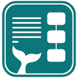
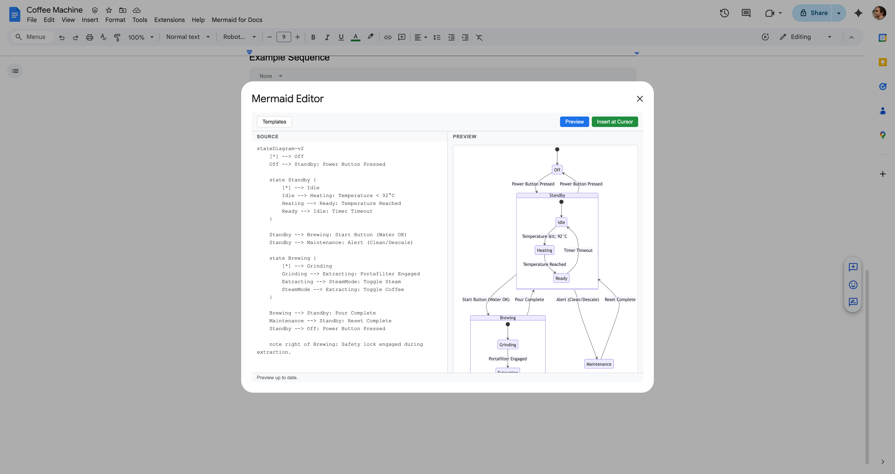
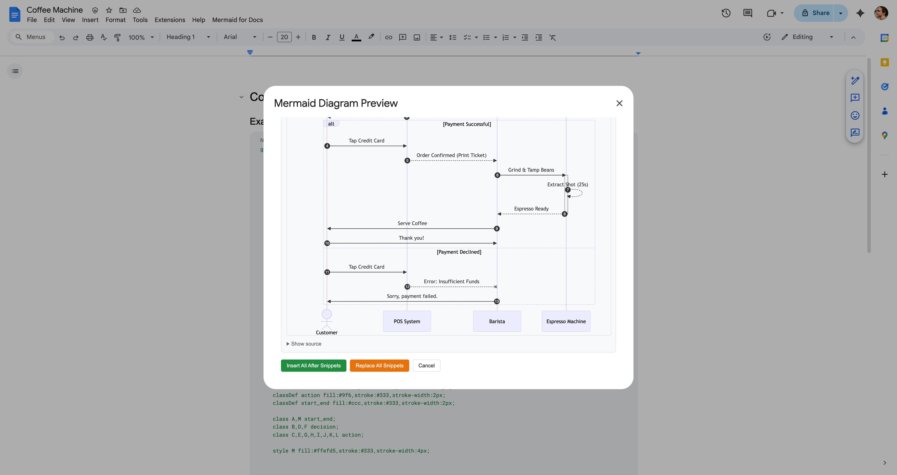
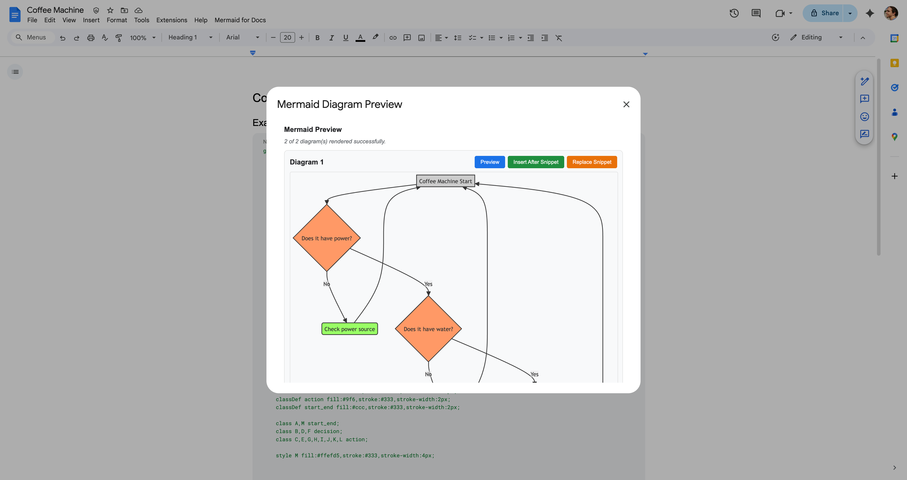
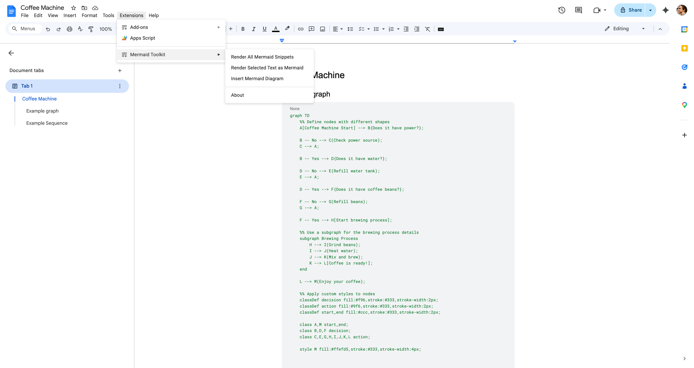

  

<h1 align="center">Mermaid Toolkit for Google Docs™</h1>

  Render Mermaid diagrams as images directly in Google Docs™. 
  Client-side rendering — no data leaves your browser.

  <!-- TODO: Replace with actual Marketplace URL once published -->
  
  

---

## Features

- **Auto-detect & render** — Finds Mermaid code snippets in your document and renders them as high-quality images
- **Live editor** — Side-by-side editor with real-time preview, syntax highlighting, and starter templates
- **Insert or replace** — Insert rendered diagrams after code snippets, or replace the code blocks entirely
- **Template library** — Quickly start with flowcharts, sequence diagrams, class diagrams, and more
- **100% client-side** — All rendering happens in your browser via [mermaid.js](https://mermaid.js.org/). No data is sent to any server

## Screenshots

### Live Editor

### Render Preview (single diagram)

### Render Preview (all diagrams)

### Extensions Menu

## Installation

<!-- TODO: Replace # with actual Marketplace URL once published -->
1. Visit the [Google Workspace Marketplace™ listing](#)
2. Click **Install**
3. Grant the required permissions (see [Privacy](#privacy))
4. Open any Google Doc — the add-on appears under **Extensions → Mermaid Toolkit**

## How to Use

### Render existing Mermaid code

1. In your Google Doc, insert a code block: **Insert → Building blocks → Code block**
2. Write your Mermaid syntax inside the code block
3. Go to **Extensions → Mermaid Toolkit → Render All Mermaid Snippets**
4. A preview dialog shows each detected diagram — click **Insert** or **Replace**

> **Important:** The first line of your code block must be a diagram type keyword (e.g. `graph TD`, `sequenceDiagram`, `erDiagram`). Comments (`%%`) are fine after the first line, but a comment on the very first line will prevent the snippet from being detected.

### Use the built-in editor

1. Go to **Extensions → Mermaid Toolkit → Insert Mermaid Diagram**
2. Write or paste Mermaid syntax in the left panel
3. See the live preview on the right
4. Pick a template from the dropdown to get started quickly
5. Click **Insert into Document** when you're happy with the result

### Other menu options

- **Render Selected Text as Mermaid** — Select text in your document and render just that as a diagram
- **About** — Version info and links

## Supported Diagram Types

The add-on detects code blocks that start with any of the following keywords:

| Diagram | Keyword |
|---|---|
| Flowchart | `flowchart` / `graph` |
| Sequence Diagram | `sequenceDiagram` |
| Class Diagram | `classDiagram` |
| State Diagram | `stateDiagram` |
| ER Diagram | `erDiagram` |
| Gantt Chart | `gantt` |
| Pie Chart | `pie` |
| Git Graph | `gitGraph` |
| User Journey | `journey` |
| Mindmap | `mindmap` |
| Timeline | `timeline` |
| Sankey | `sankey` |
| XY Chart | `xychart` |
| Block Diagram | `block-beta` |
| Packet Diagram | `packet-beta` |
| Quadrant Chart | `quadrantChart` |
| Requirement Diagram | `requirementDiagram` |
| ZenUML | `zenuml` |
| C4 Diagrams | `c4context` / `c4container` / `c4component` / `c4dynamic` / `c4deployment` |

See the [mermaid.js docs](https://mermaid.js.org/) for syntax details on each type.

## Privacy

This add-on **does not collect, store, or transmit any data**. All diagram rendering happens locally in your browser. No analytics, no tracking, no cookies.

The add-on requests only two OAuth scopes:
- `documents.currentonly` — to read code snippets and insert images in the current document
- `script.container.ui` — to display dialog windows

Read the full [Privacy Policy](PRIVACY.md).

## Terms of Service

This add-on is provided "as is" without warranty. It is free to use and not affiliated with Google or Mermaid.js.

Read the full [Terms of Service](TERMS.md).

## Support

Need help or have feedback? Visit the [Support page](https://numanaral.github.io/mermaid-toolkit-for-google-docs/support) for all the ways to reach us.

- **Bug reports:** [Open an issue](https://github.com/numanaral/mermaid-toolkit-for-google-docs/issues)
- **Questions & feedback:** [Join the discussion](https://github.com/numanaral/mermaid-toolkit-for-google-docs/discussions)

## License

[MIT](LICENSE) — Copyright (c) 2026 Numan Aral

---

  Created by <a href="https://numanaral.github.io?ref=mermaid-toolkit-for-google-docs">Numan Aral</a>

Google Docs™ and Google Workspace™ are trademarks of Google LLC. This add-on is not affiliated with or endorsed by Google.
