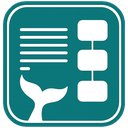

  

<h1 align="center">Mermaid for Google Docs</h1>

  Render Mermaid diagrams as images directly in Google Docs. 
  Client-side rendering — no data leaves your browser.

  <!-- TODO: Replace with actual Marketplace URL once published -->
  
  

---

## Features

- **Auto-detect & render** — Finds Mermaid code snippets in your document and renders them as high-quality images
- **Live editor** — Side-by-side editor with real-time preview, syntax highlighting, and starter templates
- **Insert or replace** — Insert rendered diagrams after code snippets, or replace the code blocks entirely
- **Template library** — Quickly start with flowcharts, sequence diagrams, class diagrams, and more
- **100% client-side** — All rendering happens in your browser via [mermaid.js](https://mermaid.js.org/). No data is sent to any server

## Screenshots

<!-- TODO: Add screenshots after taking them -->
<!--  -->
<!--  -->
<!--  -->

*Screenshots coming soon.*

## Installation

<!-- TODO: Replace # with actual Marketplace URL once published -->
1. Visit the [Google Workspace Marketplace listing](#)
2. Click **Install**
3. Grant the required permissions (see [Privacy](#privacy))
4. Open any Google Doc — the add-on appears under **Extensions → Mermaid for Docs**

## How to Use

### Render existing Mermaid code

1. In your Google Doc, insert a code block: **Insert → Building blocks → Code block**
2. Write your Mermaid syntax inside the code block
3. Go to **Extensions → Mermaid for Docs → Render All Mermaid Snippets**
4. A preview dialog shows each detected diagram — click **Insert** or **Replace**

### Use the built-in editor

1. Go to **Extensions → Mermaid for Docs → Insert Mermaid Diagram**
2. Write or paste Mermaid syntax in the left panel
3. See the live preview on the right
4. Pick a template from the dropdown to get started quickly
5. Click **Insert into Document** when you're happy with the result

### Other menu options

- **Diagnostic** — Check your Mermaid syntax for errors
- **Inspector** — View details about diagrams already in your document
- **About** — Version info and links

## Supported Diagram Types

Mermaid for Google Docs supports all diagram types available in [mermaid.js](https://mermaid.js.org/), including:

| Diagram | Example Syntax |
|---|---|
| Flowchart | `graph TD; A-->B;` |
| Sequence Diagram | `sequenceDiagram; Alice->>Bob: Hi` |
| Class Diagram | `classDiagram; Animal <\|-- Duck` |
| State Diagram | `stateDiagram-v2; [*] --> Active` |
| ER Diagram | `erDiagram; CUSTOMER \|\|--o{ ORDER : places` |
| Gantt Chart | `gantt; title Plan; task1 :a1, 2026-01-01, 30d` |
| Pie Chart | `pie; "A" : 40; "B" : 60` |
| Git Graph | `gitGraph; commit; branch dev` |
| Mindmap | `mindmap; root((Topic))` |
| Timeline | `timeline; 2026 : Event` |
| And more... | See [mermaid.js docs](https://mermaid.js.org/) |

## Privacy

This add-on **does not collect, store, or transmit any data**. All diagram rendering happens locally in your browser. No analytics, no tracking, no cookies.

The add-on requests only two OAuth scopes:
- `documents.currentonly` — to read code snippets and insert images in the current document
- `script.container.ui` — to display dialog windows

Read the full [Privacy Policy](PRIVACY.md).

## Terms of Service

This add-on is provided "as is" without warranty. It is free to use and not affiliated with Google or Mermaid.js.

Read the full [Terms of Service](TERMS.md).

## Support

- **Bug reports:** [Open an issue](https://github.com/numanaral/mermaid-for-google-docs/issues)
- **Questions & feedback:** [Join the discussion](https://github.com/numanaral/mermaid-for-google-docs/discussions)

## License

[MIT](LICENSE) — Copyright (c) 2026 Numan Aral

---

  Created by <a href="https://numanaral.github.io">Numan Aral</a>

